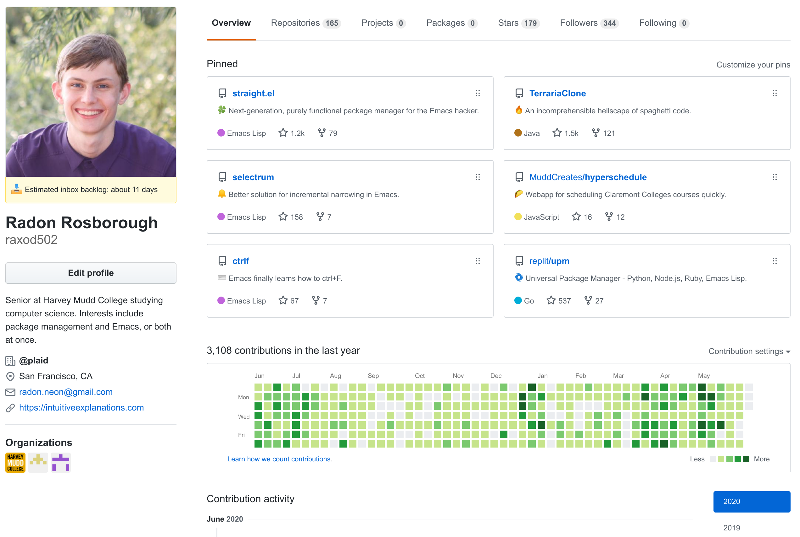

# GitHub Email Backlog

This is a Chrome extension that looks at your GitHub notifications
inbox and tries to guess how long it will take you to respond to new
ones, then posts this information to your profile status:

  

## Motivation

I participate in many threads on GitHub, mostly on account of
maintaining a large number of projects which receive issues and pull
requests. I value taking the time to respond to all of them (or at
least the ones that require action) in a reliable manner. On the other
hand, my time is limited, and I don't find it enjoyable to spend all
day reading email. To address this problem, I reserve one hour each
day for doing chores like email, and anything that's not finished I
take care of the next day. What this means is that low-priority chores
like hard-to-address GitHub threads may wait a fair while before I can
get to them, depending on what else is going on. I figured it would be
nice if people had an idea of how timely a response they should expect
from me. (But mostly, this project is because I realized I could apply
a complicated technical solution to a problem that didn't really need
one, and I *love* doing that.)

## Algorithm

I abuse the GitHub notifications API. Normally, it's supposed to
represent whether I've seen a notification. Instead, I make it
represent whether I've *acted on* the notification (by responding to
it, by making a code change, or by looking at it properly and deciding
that no response is needed). Here is how the Chrome extension
estimates my response time:

* Fetch successive pages of GitHub notifications until finding a page
  that is at least 90% read notifications.
* Determine the overall fraction of all these notifications that are
  unread, say 70%.
* Look at the timestamp of the notification at that percentile, in the
  previous example the notification 70% of the way down the list
  sorted from newest to oldest.
* Compute the duration from that notification's timestamp to the
  current date.
* Multiply by two. This is what I report as my estimated response time.

*Why multiply by two?* I want to account for the problem of spikes in
response time. Sometimes I become busy with non-email-related chores,
and go for a while without responding to any email. In this case, it's
impossible to know how long it will be until I start responding again.
However, if it's been five days since I stopped responding, on average
with no extra information we can assume it will be five days until I
start again (this is from some results in Bayesian probability
theory). On the other hand, if there are five days of email in my
inbox as a steady state, we can expect it will take new emails five
days to make their way to the front of the queue. Combining these
figures in a way that prefers overestimating to underestimating
results in a guess of ten days. (Notice that the heuristic is based on
wild speculation and not actual data or any solid reasoning.)

## Usage requirements

Unfortunately, this approach will probably not work for you, unless
you happen to be abnormally similar to me. It only works subject to
the following constraints:

* You can commit to not viewing any thread on GitHub until you're
  ready to deal with it right then.
* You can disable GitHub's tracking pixels on every platform on which
  you read email, or can commit to never opening GitHub's notification
  emails.
* You process emails in a similar manner to me (namely, you put in a
  similar amount of work on it each day and roll over remaining emails
  to the next day).
